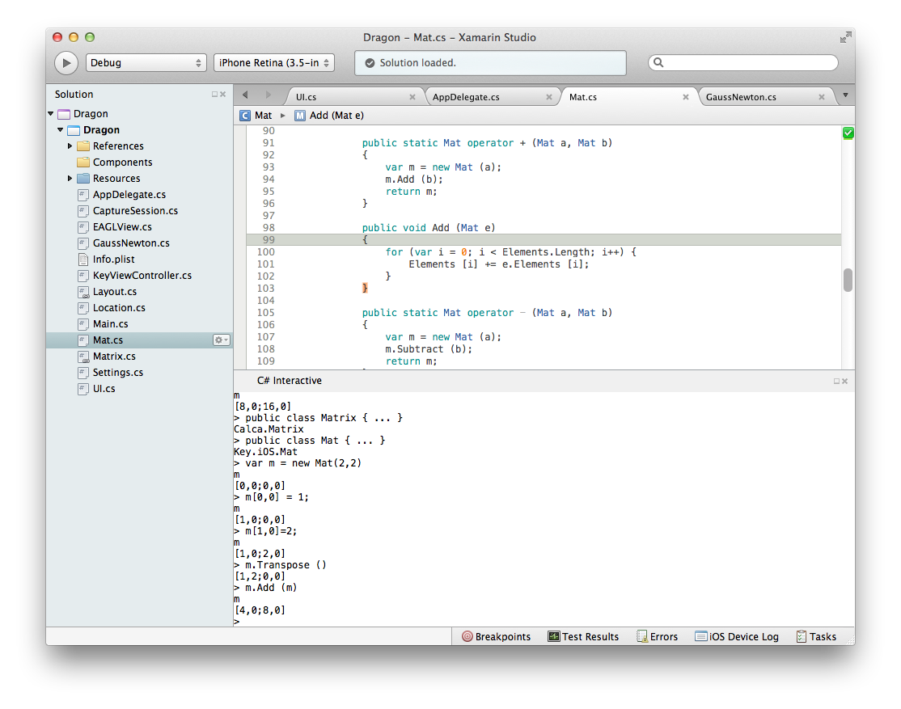
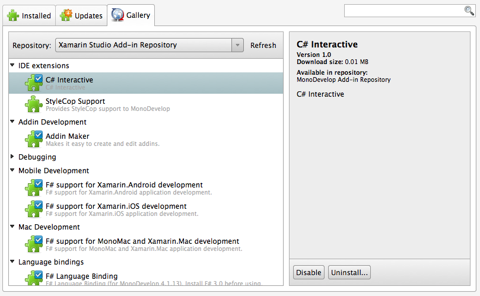

# C# Interactive

CSharpInteractive provides a Read-Eval-Print-Loop in Xamarin Studio using the [csharp][] utility that comes with mono.

It does this by exposing a dockable pad that redirects input and output from that tool. This gives you an easy way to test your ideas while you're coding.

It also adds two commands to the editor to make sending code to the REPL easier.

## Send selection or line

**Ctrl + Return** triggers this command.

If text is selected, and it is not whitespace, then it is trimmed and sent to the REPL.

If there is no selection, the current line is sent to the REPL if it is not blank.

This enables you to simultaneously write code in the editor and execute and interact with it live in the REPL.

## Send type

**Ctrl + Shift + Return** triggers this command.

The outermost type that contains the caret position is sent to the REPL in its entirety.

This is useful if you want to send all the code for a class, struct, interface, or enum to your interactive session.

It also automatically executes a `using` for the namespace of the type so that you can interact with it by name.

# Installation

Open the **Add-in Manager** in Xamarin Studio. Go to the **Gallery** and choose to install **C# Interactive**.

# Please contribute

This project is the product of a night of hacking. It works, but has lots of bugs. I'm happy to take contributions to make it more robust and feature rich.

# Thanks

This project is based heavily on the [F# Interactive Xamarin Studio add-in][fsi]. Thank you!

It wouldn't be possible without the work done by all the **csharp** contributors.

# License

MIT

[csharp]: http://www.mono-project.com/CsharpRepl
[fsi]: https://github.com/fsharp/fsharpbinding/tree/master/monodevelop

